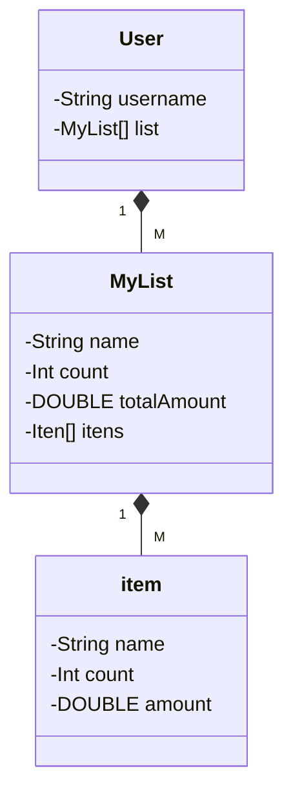

# Lista de compras

### Diagrama

```mermaid
classDiagram
  class User {
    -String username
    -MyList[] list
  }

  class MyList {
    -String name
    -Int count
    -DOUBLE totalAmount
    -Iten[] itens
  }
  class item {
    -String name
    -Int count
    -DOUBLE amount 
  }
  
  User "1" *-- "M" MyList 
  MyList "1" *-- "M" item 
```